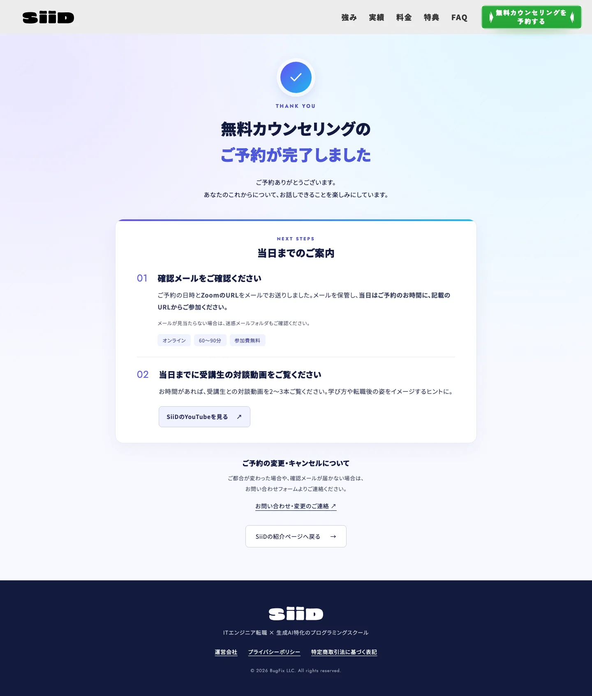
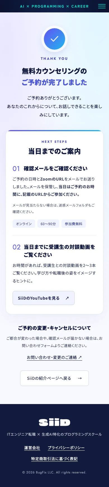

# Issue #69 予約完了ページの確認記録

2026-09-09。`/siid/lp-2/complete` を新設。既存LPの共通ヘッダー・フッターを再利用し、確認メール・当日の参加・対談動画・変更/キャンセルの案内を掲載。

## 検証

- `npm run lint` / `npm run typecheck` / `npm run build`：成功。
- 本番ビルドを1440 / 839 / 390 / 319pxで確認。横はみ出しなし。本文・カードは可変高さ。
- PCヘッダーとSPドロワーのリンクは `/siid/lp-2#...`。LP本文で使う既存ヘッダーの既定値はローカルアンカーのまま。
- メタデータ：noindex, nofollow。canonicalは `https://bug-fix.org/siid/lp-2/complete`。sitemapから除外。
- 新規本文は全文字版Noto Sans JPを使用。LPのサブセットに含まれない漢字でもフォントが混在しない。
- 既存のPhaserのdefault export警告とmicroCMS未設定の警告は今回の変更と無関係。

## 公開時に残る設定

Jicooの管理画面は未変更。予約ページの「ワークフロー → リダイレクト → 予約完了後」に新しい公開URLを設定する必要がある。LP1と同じ予約IDを共有しているため、片方だけ分ける場合は予約ページを複製する。詳細は[仕様書](../../spec/07_lp2-renewal.md)の「予約完了ページ」参照。

実予約の送信・確認メール受信・Jicooからの本番転送は未実施。リポジトリにはJicoo管理画面の設定や契約情報がないため、設定後の受入確認が必要。

## 確認画像（本番ビルド）

Cookieバナーの拒否ボタンを押して本文を撮影。LPから保存済みの同意状態も共通で使用する。

## 独立レビュー

別担当によるコード・4幅の画像レビューで合格。PC案内見出しの不要な左paddingを修正し、番号と本文の位置を再確認した。新規の導線・メタデータ・画面崩れの指摘なし。

## 追加フィードバック対応

「当日までのご案内」の01に確認メールと当日のZoom参加方法を統合。別セクションだった受講生対談動画とボタンを同じカードの02へ移動した。lint・typecheck・build成功。1440 / 839 / 390 / 319pxの表示を再確認し、画像を更新。独立コードレビューでも追加指摘なし。
