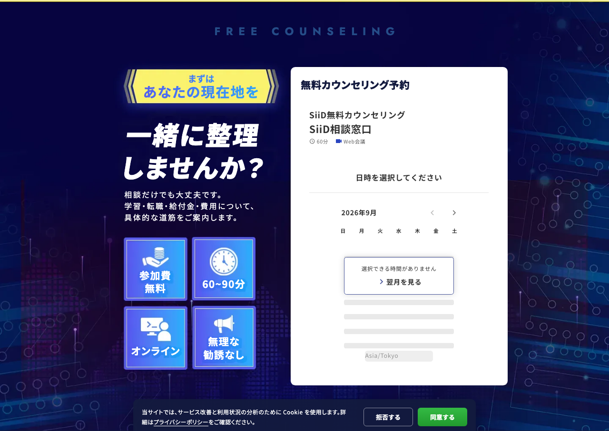

# Issue #71 予約フォームの高さ安定化

## 原因と変更

ユーザー指定の3001番は古いチェックアウトから起動され、フォームが絶対配置されていた。最新developの通常フローの白カードを土台に修正。

公式ホストは高さ通知を毎回上書きし、自動スクロール通知にも反応する。通知654→1200→700pxでカードが縮むことを修正前のfixtureで再現した。

lp-careerのホストで対象iframeからの通知のみ処理し、高さの最大値を保持する。短い画面へ戻った際は余白を残すことで入力位置を安定させ、強制スクロールをしない。白カードはiframeの高さに追従する。完了時の相対・絶対URL転送は維持。

## 検証

- lint / typecheck / build成功。
- 1440 / 839 / 390 / 319pxで、654→1200→700→1180→650の高さ通知を検証。縮小なし、iframe下端が白カード内に収まる。
- scrollWidgetTop通知でページが移動しないこと、無効な高さ・別の送信元の通知を無視することを確認。
- PCでは絶対URL、SPでは相対URLの完了ページ転送を確認。
- `LP_CAREER_TEST_ORIGIN=http://localhost:3001 node scripts/lp-career/check-booking-layout.cjs` で再実行可能。Jicooページをfixtureに置換するため実予約は作成しない。
- 独立レビューで指摘された相対URLの解決基準を修正し、再検証済み。

当初は実Jicooに「選択できる時間がありません」と表示され枠選択後を検証できなかったが、2026-09-11 に予約枠が復活したため実フォームで日付・時間選択から入力画面まで検証済み（結果は `docs/spec/07_lp-career-renewal.md` の Issue #71 節）。予約送信は行っていない。下の画像は実フォームの初期表示。

