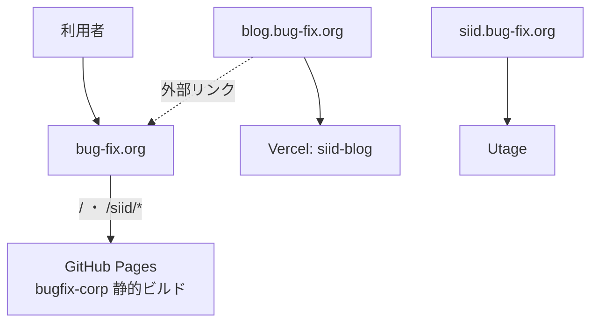
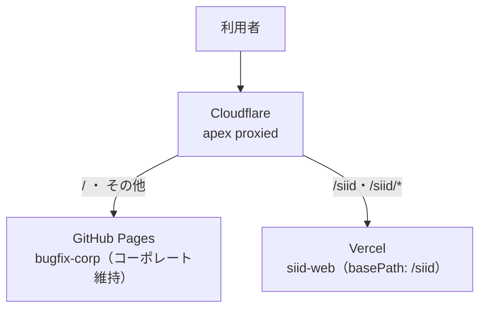

# 06. 移行・リリース計画(現行 bug-fix.org/siid → 新 SiiD サービスサイト)

新 Next.js 版 SiiD サービスサイト(本リポジトリ `siid-web`)が完成したのち、現行の `https://bug-fix.org/siid` を置き換えるためのリリース計画。**`/siid` のみをリニューアルし、運営会社コーポレートサイト(`/`)はそのまま残す**ことを制約とする(Issue #22)。

> **2026-09-10 方針変更**: 当初は既存 LP `/siid/lp-1` も GitHub Pages のまま残す計画だったが、lp-1 は Issue #40 で本アプリへ移植済みであり、さらに**廃止して今後は `/siid/lp-career` を使う**ことに決定した。これにより `/siid` 配下はすべて新アプリ(Vercel)へ向け、`/siid/lp-1` は `/siid/lp-career` へ 301 で寄せる(§3.2・§4)。

デプロイ全体方針は [05_deploy.md](./05_deploy.md) を参照。本ドキュメントは「現行サイトからの移行」に固有の計画を扱う。

---

## 1. 背景・目的

現行の `bug-fix.org` は **1 リポジトリ・1 デプロイ**で複数の面を配信しており、`/siid` だけを単純に差し替えることができない。パス単位で新旧を分離するには、ドメイン前段にルーティング層を設ける必要がある。

- 新サイト完成後、現行 SiiD サービスサイト(`/siid` 配下)のみを新 Next.js アプリへ置換する。
- コーポレートサイト(`/`)は現行のまま維持し、URL も変えない。
- 既存 LP `/siid/lp-1` は廃止し、`/siid/lp-career` へ 301 で引き継ぐ(2026-09-10 決定)。
- 現行 `/siid/*` の各 URL は SEO 継続のため 301 リダイレクトで新ルートへ引き継ぐ。

---

## 2. 現行アーキテクチャ

| 面 / URL | 実体リポジトリ | ホスティング | 本移行での扱い |
|---|---|---|---|
| `bug-fix.org/`(コーポレート) | `bugfix-corp`(Vite + EJS 静的サイト) | GitHub Pages | **維持** |
| `bug-fix.org/siid`, `/siid/*` | 同上(`src/pages/siid/*`) | GitHub Pages | **新サイトへ置換** |
| `bug-fix.org/siid/lp-1` | 同上(`src/pages/siid/lp-1/`、自己完結) | GitHub Pages | **廃止**(`/siid/lp-career` へ 301) |
| `blog.bug-fix.org` | `siid-blog`(Next.js + microCMS) | Vercel | 対象外(`/siid` へ外部リンクするのみ) |
| `siid.bug-fix.org` | Utage(`dns.utage-domain.com`) | 外部SaaS | 対象外(流用不可) |

**ポイント:**
- コーポレート(`/`)と `/siid` は `bugfix-corp` の**同一ビルドパイプライン**から生成され、共有 EJS パーシャル(`src/modules/layout/_header.html` ほか)・共有データ(`src/data/mainData.js`)・共有 SCSS に依存している。ソース上は完全分離されていない。
- `/siid/lp-1` は独自 `assets/`(専用 CSS/JS/フォント/画像)を持ち、共有ヘッダー/フッターに非依存。**単体で維持しやすい**。
- `bugfix-corp` は GitHub Actions(`.github/workflows/static.yml`)で `main` push 時に `dist/` を GitHub Pages へ publish。カスタムドメインは `CNAME` = `bug-fix.org`。

**課題:** GitHub Pages はパス単位で別バックエンドへ振り分けできない。`/`(維持)と `/siid`(置換)を分離するには、ドメイン前段のルーティング層が必須。

---

## 3. 目標アーキテクチャ(Cloudflare 前段方式)

DNS を Cloudflare 管理下に置き、`bug-fix.org` を **Cloudflare Worker** でパス分岐させる。コーポレートは GitHub Pages のまま維持し、`/siid` 配下だけを新アプリ(Vercel)へ **URL を変えずにリバースプロキシ**する。

### 3.1 DNS

- `bug-fix.org`(apex)および `www` を Cloudflare 管理へ移管し、**proxied(orange-cloud)** にする。
- `blog.bug-fix.org`(Vercel)・`siid.bug-fix.org`(Utage)は**現状維持**(DNS-only / プロキシ対象外)。既存挙動を変えない。

### 3.2 Cloudflare Worker(ルーティング)

Redirect Rule ではなく **Worker** を用いる。URL を `bug-fix.org/siid/...` のまま保ちつつ別オリジン(Vercel)の内容を返す**リバースプロキシ**が必要なため(Redirect Rule では URL が変わってしまう)。

分岐ロジック(lp-1 の廃止により 2 分岐。2026-09-10 改訂):

1. パスが **`/siid` と完全一致、または `/siid/` で始まる** → **Vercel の新アプリ**(`https://siid-web-theta.vercel.app` に同じパスとクエリで fetch して返す)。`/siid/lp-1` もここに含まれ、新アプリの 301(§4)で `/siid/lp-career` へ転送される
2. それ以外(`/` 等すべて)→ **GitHub Pages**(コーポレート維持。オリジンへそのまま通す)

- 前方一致を `/siid` だけで判定しないこと(`/siid-xxx` のような将来のコーポレート側パスまで新アプリへ流れるため)。
- Worker を `bug-fix.org/siid*` のルートに紐付ければ `/` などのコーポレート宛リクエストは Worker を通らない。ただしこのルートは `/siid-xxx` にも一致するため、**Worker 内でも上記の判定を必ず行い、一致しないリクエストはオリジン(GitHub Pages)へそのまま通す**こと(ルートの絞り込みだけに頼ると `/siid-xxx` が Vercel へ流れて 404 になる)。

**プロキシ応答のヘッダー処理(必須)**: 新アプリは Host が `*.vercel.app` のリクエストに `X-Robots-Tag: noindex` を付与する(直 URL の重複インデックス対策、Issue #14 / [05_deploy.md](./05_deploy.md))。Worker のオリジン fetch も Host は `*.vercel.app` になるため、**Worker は `bug-fix.org` へ返す応答から `X-Robots-Tag` ヘッダーを必ず削除する**こと。削除しないと本番サイト全体が検索エンジンから noindex 扱いになる。

### 3.3 新アプリ側(Vercel `siid-web`)

- `next.config.ts` に `basePath: '/siid'`(必要に応じ `assetPrefix`)を設定し、内部リンク・アセットパスを `/siid` 配下へ整合させる。
- Vercel 本番デプロイ。Worker はこのデプロイ URL の `/siid/*` を取得する。
- `basePath: '/siid'` は設定済み(Issue #46)。`redirects()` は未設定で、§4 のマップを Issue #48 で追加する。

---

## 4. URL リダイレクトマップ(旧 `/siid/*` → 新ルート、301)

旧サブページと新サイトのルートは 1:1 対応しないため、SEO 継続のための対応表を定める。**Issue #48 で `next.config.ts` の `redirects()` に実装済み**(basePath `/siid` 込み、ステータス 301)。

旧サイトの正規 URL は末尾スラッシュ付き(`/siid/career/`)。新アプリは末尾スラッシュを外す(308)ため、旧 URL からは「308 → 301」の 2 ホップで新ルートに着地する(クエリ文字列は保持)。

| 旧 URL | 新ルート | 状態 |
|---|---|---|
| `/siid` | `/siid`(新トップ) | パス一致。リダイレクト不要 |
| `/siid/career` | `/siid/career-path/1` | 実装済み(301)。`/career-path` は `/career-path/1` へのリダイレクトなので正規 URL へ直接送る |
| `/siid/counseling` | 同一パスで実装済み | リダイレクト不要 |
| `/siid/counseling-complete` | 同一パスで実装済み(旧 URL 互換ページ) | リダイレクト不要(`redirects()` はページより優先されるため、ここに 301 を置くと互換ページが死ぬ) |
| `/siid/counseling-complete-lp-1` | `/siid/lp-career/complete` | 実装済み(301。2026-09-12 決定)。ページは削除。このページが発火していた OpenAI Ads の CV は止まる(lp-career 側の計測は #67) |
| `/siid/white-paper` | 同一パスで実装済み(Issue #40) | リダイレクト不要 |
| `/siid/lp-1`(および `/siid/lp-1/*`) | `/siid/lp-career` | 実装済み(301)。lp-1 は削除(2026-09-10 決定)。`siid-blog` の `COUNSELING_URL` の受け皿 |
| `/siid/lp-2`(および `/siid/lp-2/*`) | `/siid/lp-career` | 実装済み(301)。Issue #76 の改名前 URL の保険(未公開だが外部設定・共有 URL に残っている可能性) |
| `/siid/tuition` | `/siid/courses` | 実装済み(301。2026-09-12 決定)。料金 → コース一覧 |
| `/siid/voices` | `/siid/career-path/1` | 実装済み(301。2026-09-12 決定)。受講生の声 → 卒業生の進路 |

---

## 5. カットオーバー手順(段階リリース)

各ステップ後に回帰確認を行い、問題なければ次へ進む。

- **Pre. DNS 移管**
  - 現行 DNS の TTL を短縮 → ネームサーバを Cloudflare へ切替 → apex を proxied 化。
  - この時点では Worker 未設定 or 全パス GitHub Pages のままとし、**挙動が現行と変わらない**ことを確認。
- **Step1. 新アプリ本番デプロイ(301 込み)**
  - `siid-web` を Vercel に `basePath: '/siid'` で本番デプロイ(`develop` → `main` のリリース PR)。Vercel の直 URL で単体動作確認。
  - **§4 の 301(`redirects()`)と lp-1 の削除はこの時点で入れておく**。`redirects()` は新アプリに届いたリクエストにしか効かないため、Worker 切替前に入れても本番に影響しない。切替後に入れる順序だと、lp-1 削除済みの場合 `/siid/lp-1` が切替から 301 有効化までの間 404 になる。
- **Step2. `/siid` を新アプリへ切替**
  - Worker を有効化し、`/siid` 配下を新アプリへプロキシ。
  - **回帰確認**: `/`(コーポレート)が従来どおり GitHub Pages で表示されること。§4 の全旧 URL が新ルートへ 301 で到達すること(`/siid/lp-1` → `/siid/lp-career` を含む)。§8 のチェックリストを実施。
- **公開後**
  - Google Search Console でインデックス移行・クロールエラーを監視。

---

## 6. ロールバック手順

- **`/siid` の切り戻しは Worker のルート設定を戻すだけ**で、即座に GitHub Pages(現行 SiiD サービスサイト)へ復帰できる。DNS の切替は伴わない。
- DNS 移管そのものを戻す必要が生じた場合は、ネームサーバを元に戻す(TTL 短縮済みのため反映は早い)。

---

## 7. アナリティクス引き継ぎ

現行本番ページで検出されているタグ:

- GA4: `G-54L1JQ7Q7V`
- GTM: `GTM-58D75LLL` / `GTM-NWT5NTNS` / `GTM-PCDDS7MV`

これらのうち **SiiD 固有分**と **`bug-fix.org` 全体で共有している分**の切り分けが未確定。Analytics 移行は既存 PR ではスコープ外とされ、サイト全体の別 Issue に送られている([03_pages.md](./03_pages.md) 参照)。本計画では引き継ぎ**要件の列挙に留め**、実引き継ぎは別 Issue で扱う。

---

## 8. 公開前チェックリスト(移行固有)

[05_deploy.md](./05_deploy.md) の汎用チェックリストに加え、移行固有で以下を確認する。

- [ ] `/siid/lp-1`(および配下)が `/siid/lp-career` へ 301 で到達する
- [ ] コーポレート `/` に一切変化がない
- [ ] 旧 `/siid/*` の全 URL が §4 のマップどおり 301 で新ルートへ到達する
- [ ] 新アプリが `basePath: '/siid'` でアセット 404 を出さない(CSS/画像/フォント/JS)
- [ ] 既存外部リンクの生存: `siid-blog` の `SIID_SITE_URL`(= `bug-fix.org/siid`)・`COUNSELING_URL`(= `bug-fix.org/siid/lp-1`、301 で `lp-career` へ)がリンク切れにならない。公開後は `COUNSELING_URL` 自体を `/siid/lp-career` に更新して 301 を経由しないようにする
- [ ] Worker の分岐が意図どおり(`/siid` と `/siid/*` だけが新アプリへ、`/siid-xxx` や `/` はコーポレートへ)
- [ ] `bug-fix.org/siid` の本番レスポンスに `X-Robots-Tag: noindex` が**付いていない**こと(Worker が除去)/ `*.vercel.app` 直アクセスには**付いている**こと(§3.2 参照)
- [ ] Vercel の Production 環境変数に `MICROCMS_SERVICE_DOMAIN` / `MICROCMS_API_KEY` が入っており、TOP の News・卒業生の進路と `/siid/career-path` に記事が表示される(未設定だと「インタビュー記事を読み込めませんでした」になる。[08](./08_career-path-interviews.md) §6)

---

## 9. 未確定事項

- DNS(`bug-fix.org` apex)を Cloudflare へ移管することのオーナー承認
- GA4 / GTM 各タグの SiiD 固有・共有の切り分けと引き継ぎ範囲
- `/siid/counseling` の Jicoo ウィジェット(`event_types/dPvwnhRYxhQB`, [03_pages.md](./03_pages.md) 参照)を本番でそのまま共有してよいか
- ~~実装スコープを扱う後続 Issue の起票~~ → 起票済み: #45(DNS 移管)・#46(basePath、完了)・#47(Worker)・#48(301)
