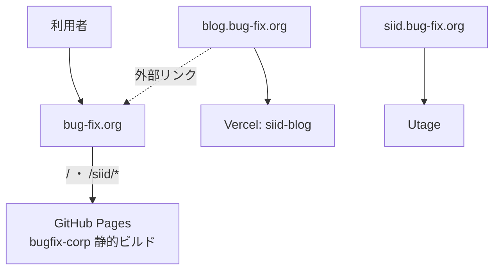
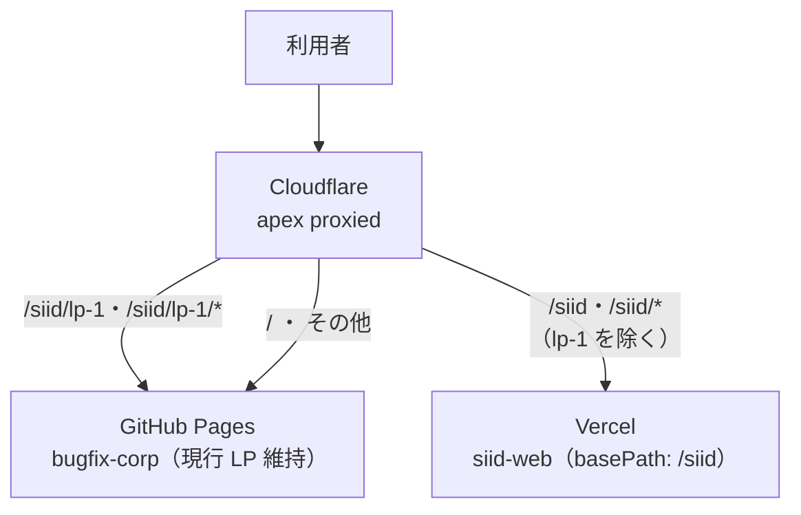

# 06. 移行・リリース計画(現行 bug-fix.org/siid → 新 SiiD サービスサイト)

新 Next.js 版 SiiD サービスサイト(本リポジトリ `siid-web`)が完成したのち、現行の `https://bug-fix.org/siid` を置き換えるためのリリース計画。**`/siid` のみをリニューアルし、運営会社コーポレートサイト(`/`)と既存ランディングページ(`/siid/lp-1`)はそのまま残す**ことを制約とする(Issue #22)。

デプロイ全体方針は [05_deploy.md](./05_deploy.md) を参照。本ドキュメントは「現行サイトからの移行」に固有の計画を扱う。

---

## 1. 背景・目的

現行の `bug-fix.org` は **1 リポジトリ・1 デプロイ**で複数の面を配信しており、`/siid` だけを単純に差し替えることができない。パス単位で新旧を分離するには、ドメイン前段にルーティング層を設ける必要がある。

- 新サイト完成後、現行 SiiD サービスサイト(`/siid` 配下)のみを新 Next.js アプリへ置換する。
- コーポレートサイト(`/`)と既存 LP(`/siid/lp-1`)は現行のまま維持し、URL も変えない。
- 現行 `/siid/*` の各 URL は SEO 継続のため 301 リダイレクトで新ルートへ引き継ぐ。

---

## 2. 現行アーキテクチャ

| 面 / URL | 実体リポジトリ | ホスティング | 本移行での扱い |
|---|---|---|---|
| `bug-fix.org/`(コーポレート) | `bugfix-corp`(Vite + EJS 静的サイト) | GitHub Pages | **維持** |
| `bug-fix.org/siid`, `/siid/*` | 同上(`src/pages/siid/*`) | GitHub Pages | **新サイトへ置換** |
| `bug-fix.org/siid/lp-1` | 同上(`src/pages/siid/lp-1/`、自己完結) | GitHub Pages | **維持** |
| `blog.bug-fix.org` | `siid-blog`(Next.js + microCMS) | Vercel | 対象外(`/siid` へ外部リンクするのみ) |
| `siid.bug-fix.org` | Utage(`dns.utage-domain.com`) | 外部SaaS | 対象外(流用不可) |

**ポイント:**
- コーポレート(`/`)と `/siid` は `bugfix-corp` の**同一ビルドパイプライン**から生成され、共有 EJS パーシャル(`src/modules/layout/_header.html` ほか)・共有データ(`src/data/mainData.js`)・共有 SCSS に依存している。ソース上は完全分離されていない。
- `/siid/lp-1` は独自 `assets/`(専用 CSS/JS/フォント/画像)を持ち、共有ヘッダー/フッターに非依存。**単体で維持しやすい**。
- `bugfix-corp` は GitHub Actions(`.github/workflows/static.yml`)で `main` push 時に `dist/` を GitHub Pages へ publish。カスタムドメインは `CNAME` = `bug-fix.org`。



**課題:** GitHub Pages はパス単位で別バックエンドへ振り分けできない。`/`(維持)・`/siid`(置換)・`/siid/lp-1`(維持)を分離するには、ドメイン前段のルーティング層が必須。

---

## 3. 目標アーキテクチャ(Cloudflare 前段方式)

DNS を Cloudflare 管理下に置き、`bug-fix.org` を **Cloudflare Worker** でパス分岐させる。コーポレートは GitHub Pages のまま維持し、`/siid`(lp-1 を除く)だけを新アプリ(Vercel)へ **URL を変えずにリバースプロキシ**する。



### 3.1 DNS

- `bug-fix.org`(apex)および `www` を Cloudflare 管理へ移管し、**proxied(orange-cloud)** にする。
- `blog.bug-fix.org`(Vercel)・`siid.bug-fix.org`(Utage)は**現状維持**(DNS-only / プロキシ対象外)。既存挙動を変えない。

移管の具体的な手順・現行レコード一覧・注意点は **[§10 DNS 移管手順書](#10-dns-移管手順書issue-45)** を参照。

### 3.2 Cloudflare Worker(ルーティング)

Redirect Rule ではなく **Worker** を用いる。URL を `bug-fix.org/siid/...` のまま保ちつつ別オリジン(Vercel)の内容を返す**リバースプロキシ**が必要なため(Redirect Rule では URL が変わってしまう)。

分岐ロジック(**評価順が重要** — lp-1 の除外を一般 `/siid` ルールより先に判定する):

1. `/siid/lp-1` および `/siid/lp-1/*` → **GitHub Pages**(現行 LP を維持)
2. `/siid` および `/siid/*`(上記 lp-1 を除く)→ **Vercel の新アプリ**(`https://siid-web-theta.vercel.app/siid/*` を fetch して返す)
3. それ以外(`/` 等すべて)→ **GitHub Pages**(コーポレート維持)

**プロキシ応答のヘッダー処理(必須)**: 新アプリは Host が `*.vercel.app` のリクエストに `X-Robots-Tag: noindex` を付与する(直 URL の重複インデックス対策、Issue #14 / [05_deploy.md](./05_deploy.md))。Worker のオリジン fetch も Host は `*.vercel.app` になるため、**Worker は `bug-fix.org` へ返す応答から `X-Robots-Tag` ヘッダーを必ず削除する**こと。削除しないと本番サイト全体が検索エンジンから noindex 扱いになる。

### 3.3 新アプリ側(Vercel `siid-web`)

- `next.config.ts` に `basePath: '/siid'`(必要に応じ `assetPrefix`)を設定し、内部リンク・アセットパスを `/siid` 配下へ整合させる。
- Vercel 本番デプロイ。Worker はこのデプロイ URL の `/siid/*` を取得する。
- 現状 `next.config.ts` は `images.remotePatterns`(img.youtube.com)のみで basePath / redirects は未設定 → 実装 Issue で追加する(本 Issue はスコープ外)。

---

## 4. URL リダイレクトマップ(旧 `/siid/*` → 新ルート、301)

旧サブページと新サイトのルートは 1:1 対応しないため、SEO 継続のための対応表を定める。実装は新アプリ `next.config.ts` の `redirects()`(basePath `/siid` 込み)で行う想定。**要確認**の対応は §9 未確定事項で確定させる。

| 旧 URL | 新ルート(案) | 備考 |
|---|---|---|
| `/siid` | `/siid`(新トップ) | 新アプリ `/`(basePath 適用) |
| `/siid/career` | `/siid/career-path` | 卒業生の進路 |
| `/siid/counseling` | `/siid/counseling` | 面談。パス一致 |
| `/siid/counseling-complete` | `/siid/counseling/complete` | 面談完了 |
| `/siid/counseling-complete-lp-1` | 要確認 | `/siid/counseling/complete` に集約 or 維持 |
| `/siid/tuition` | 要確認(→ `/siid/courses` 想定) | 料金 → コース一覧 |
| `/siid/voices` | 要確認(→ `/siid/career-path` 想定) | 受講生の声 |
| `/siid/white-paper` | 要確認 | 新サイトに該当ページなし |
| `/siid/lp-1` | **リダイレクトしない・維持** | 現行 LP を保持 |

---

## 5. カットオーバー手順(段階リリース)

各ステップ後に回帰確認を行い、問題なければ次へ進む。

- **Pre. DNS 移管**(Issue #45)
  - 現行 DNS の TTL を短縮 → ネームサーバを Cloudflare へ切替 → apex を proxied 化。
  - この時点では Worker 未設定 or 全パス GitHub Pages のままとし、**挙動が現行と変わらない**ことを確認。
  - **手順の詳細・現行レコード一覧・失敗しやすい点は [§10](#10-dns-移管手順書issue-45) にまとめてある。メール(Google Workspace)を止めないため必ず参照すること。**
- **Step1. 新アプリ本番デプロイ**
  - `siid-web` を Vercel に `basePath: '/siid'` で本番デプロイ。Vercel の直 URL / プレビューで単体動作確認。
- **Step2. `/siid` を新アプリへ切替**
  - Worker を有効化し、`/siid` 配下(lp-1 除く)のみ新アプリへプロキシ。
  - **回帰確認**: `/`(コーポレート)・`/siid/lp-1` が従来どおり GitHub Pages で表示されること。
- **Step3. 301 リダイレクト有効化**
  - §4 の旧 → 新リダイレクトを有効化し、全旧 URL が新ルートへ 301 で到達することを検証。
- **公開後**
  - Google Search Console でインデックス移行・クロールエラーを監視。

---

## 6. ロールバック手順

- **`/siid` の切り戻しは Worker のルート設定を戻すだけ**で、即座に GitHub Pages(現行 SiiD サービスサイト)へ復帰できる。DNS の切替は伴わない。
- DNS 移管そのものを戻す必要が生じた場合は、ネームサーバを元に戻す(TTL 短縮済みのため反映は早い)。

---

## 7. アナリティクス引き継ぎ

現行本番ページで検出されているタグ:

- GA4: `G-54L1JQ7Q7V`
- GTM: `GTM-58D75LLL` / `GTM-NWT5NTNS` / `GTM-PCDDS7MV`

これらのうち **SiiD 固有分**と **`bug-fix.org` 全体で共有している分**の切り分けが未確定。Analytics 移行は既存 PR ではスコープ外とされ、サイト全体の別 Issue に送られている([03_pages.md](./03_pages.md) 参照)。本計画では引き継ぎ**要件の列挙に留め**、実引き継ぎは別 Issue で扱う。

---

## 8. 公開前チェックリスト(移行固有)

[05_deploy.md](./05_deploy.md) の汎用チェックリストに加え、移行固有で以下を確認する。

- [ ] `/siid/lp-1`(および配下)が Worker 分岐後も現行のまま無傷で表示される
- [ ] コーポレート `/` に一切変化がない
- [ ] 旧 `/siid/*` の全 URL が §4 のマップどおり 301 で新ルートへ到達する
- [ ] 新アプリが `basePath: '/siid'` でアセット 404 を出さない(CSS/画像/フォント/JS)
- [ ] 既存外部リンクの生存: `siid-blog` の `SIID_SITE_URL`(= `bug-fix.org/siid`)・`COUNSELING_URL`(= `bug-fix.org/siid/lp-1`)がリンク切れにならない
- [ ] Worker のルート評価順(lp-1 除外 → `/siid` → その他)が意図どおり
- [ ] `bug-fix.org/siid` の本番レスポンスに `X-Robots-Tag: noindex` が**付いていない**こと(Worker が除去)/ `*.vercel.app` 直アクセスには**付いている**こと(§3.2 参照)

---

## 9. 未確定事項

- §4 リダイレクトマップの「要確認」対応先: `/siid/tuition`(→ `/siid/courses`?)、`/siid/voices`(→ `/siid/career-path`?)、`/siid/white-paper`(該当ページなし)、`/siid/counseling-complete-lp-1`(集約 or 維持)
- DNS(`bug-fix.org` apex)を Cloudflare へ移管することのオーナー承認
- GA4 / GTM 各タグの SiiD 固有・共有の切り分けと引き継ぎ範囲
- `/siid/counseling` の Jicoo ウィジェット(`event_types/dPvwnhRYxhQB`, [03_pages.md](./03_pages.md) 参照)を本番でそのまま共有してよいか
- 実装スコープ(basePath 設定・`redirects()`・Cloudflare Worker・DNS 移管・Vercel 本番設定)を扱う後続 Issue の起票

---

## 10. DNS 移管手順書(Issue #45)

カットオーバー Pre(§5)の実作業手順。**この作業はドメイン管理画面での操作であり、リポジトリのコード変更を伴わない。**

### 10.1 前提情報(2026-08 時点の実測)

| 項目 | 値 |
|---|---|
| レジストラ | **Squarespace Domains II LLC**(https://domains.squarespace.com) — **ネームサーバ変更はここで行う** |
| 現行 DNS ホスト | **Google Cloud DNS**(`ns-cloud-b1〜b4.googledomains.com`) — レコードの現物はここにある |
| ドメイン有効期限 | 2027-03-13 |
| ドメインステータス | `clientTransferProhibited`(レジストラ移管ロック)。**ネームサーバ変更にはロック解除は不要** |

> レジストラ(Squarespace)と DNS ホスト(Google Cloud DNS)が別である点に注意。**移管するのはネームサーバの向き先**であり、ドメインそのものの移管(レジストラ変更)は行わない。

### 10.2 現行レコード一覧(Cloudflare で再現すべき全レコード)

**移管の最大のリスクはレコードの取りこぼし。特に MX / SPF / DKIM / DMARC を落とすとメールが停止する。**

| 名前 | 種別 | 値 | TTL | Cloudflare での設定 |
|---|---|---|---|---|
| `bug-fix.org` | A | `185.199.108.153` / `185.199.109.153` / `185.199.110.153` / `185.199.111.153` | 3600 | **Proxied**(GitHub Pages) |
| `bug-fix.org` | AAAA | `2606:50c0:8000::153` / `8001::153` / `8002::153` / `8003::153` | — | **Proxied**(GitHub Pages) |
| `www` | CNAME | `seito-developer.github.io` | 14400 | **Proxied** |
| `blog` | CNAME | `cc021d3efa3de4c8.vercel-dns-017.com` | 14400 | **DNS only**(Vercel) |
| `siid` | CNAME | `dns.utage-domain.com` | 14400 | **DNS only**(Utage) |
| `bug-fix.org` | MX | `1 aspmx.l.google.com` / `5 alt1` / `5 alt2` / `10 alt3` / `10 alt4`(すべて `.aspmx.l.google.com`) | 14400 | **DNS only**(Google Workspace) |
| `bug-fix.org` | TXT (SPF) | `v=spf1 include:_spf.google.com +mx include:myasp.jp ~all` | 14400 | DNS only |
| `_dmarc` | TXT | `v=DMARC1; p=none;` | 14400 | DNS only |
| `google._domainkey` | TXT (DKIM) | `v=DKIM1; k=rsa; p=MIIBIjANBgkqhkiG9w0BAQEFAAOCAQ8AMIIBCgKCAQEAl6IKssV3gJzyz6WlqC+hX9GZNdxSgPniUH+Xpa2OB2SSm0sSC77e4CzvxLFr8eEfIU4QyQ2uaoNZaFKs5vDjFrsfcnme9DfERp9pyUXapTu1dzFrUpfUpwx8w+ZWPerYRHO+JMk/MLnYxZepbarQuDDl+y8BguXUn0aCrGlbgFkUaZEsOs2tfnnuT4zUFNq1OtqaVxTPRe5/DJGSHANDaBfQwjoJEHtHqKvjvYkRET0KwB6TzrKdQsUmVYSGBZrcNccgalm9bPuHwBSTPR00eFdJIrXwGHOa4y1OnAIVU/T9DjVzn9Mp8ecMfWUSepry8WCcrPl7zHmhYua753t6jQIDAQAB` | 14400 | DNS only |

- CAA レコードは未設定。
- 上記は外部から DNS を引いた結果。**作業前に Google Cloud DNS の管理画面でゾーンをエクスポートし、非公開・未使用のレコードが他に無いか必ず突き合わせること**(外部からは存在を知り得ないサブドメインがある可能性がある)。

### 10.3 失敗しやすい点(必読)

1. **SSL/TLS モードを「フル(Full)」にする。** Cloudflare の既定が「フレキシブル」だと、GitHub Pages が HTTPS へリダイレクトするためリダイレクトループ(ERR_TOO_MANY_REDIRECTS)になる。なお「フル(厳密)」は、プロキシ配下では GitHub Pages の証明書更新が失敗しうるため当面避け、**「フル」**とする。
2. **`siid.bug-fix.org` は絶対に proxied にしない。** 向き先の Utage 自体が Cloudflare 配下(解決先が `104.26.x` / `172.67.x`)のため、プロキシすると Cloudflare の多重プロキシとなり **Error 1000: DNS points to prohibited IP** で機能停止する。
3. **`blog.bug-fix.org`(Vercel)も DNS only。** Vercel 側で証明書を管理しているため、プロキシすると証明書エラーの原因になる。
4. **DKIM の TXT は 1 レコードとして登録する。** DNS 上は 255 文字ごとに分割されて見えるが、Cloudflare には分割せず全文を 1 つの値として入力する(分割して登録すると DKIM 検証が失敗する)。
5. **Cloudflare の自動レコードインポートは取りこぼす前提で確認する。** ネームサーバ切替前に、§10.2 の全レコードが Cloudflare 側に揃っているか目視で照合する。
6. **Google Cloud DNS のゾーンは削除しない。** ロールバック時にネームサーバを戻すだけで復旧できるようにするため、移管の成功を確認するまで残す。
7. **TTL 短縮は切替の 4 時間以上前に行う。** 現行 TTL が 14400 秒(4 時間)のため、短縮しても既存キャッシュが切れるまでその時間がかかる。

### 10.4 作業手順

1. **オーナー承認**(§9 の未確定事項)。apex を Cloudflare 配下に置くことの合意を得る。
2. **Google Cloud DNS でゾーンをエクスポート**し、§10.2 と突き合わせて全レコードを確定させる。
3. **Google Cloud DNS 側で全レコードの TTL を 300 秒へ短縮** → **4 時間以上待つ**(既存キャッシュの失効待ち)。
4. **Cloudflare にサイトを追加**し、§10.2 のレコードを登録。プロキシ状態(orange/grey)を表の指定どおりに設定する。
5. **SSL/TLS を「フル」に設定**(§10.3-1)。
6. **Squarespace のレジストラ管理画面でネームサーバを Cloudflare のものへ変更**。
7. **反映を確認**し、§10.5 の検証を実施する。
8. この時点では **Worker を設定しない**(全パスが従来どおり GitHub Pages / Vercel / Utage へ向く状態)。

### 10.5 検証(移管前後で同一になること)

移管前の実測ベースライン(2026-08 時点):

| URL | 移管前の応答 |
|---|---|
| `https://bug-fix.org/` | 200 |
| `https://bug-fix.org/siid` | 200 |
| `https://bug-fix.org/siid/lp-1` | 200 |
| `https://blog.bug-fix.org/` | 200 |
| `https://siid.bug-fix.org/` | 404(移管前から 404。**悪化していないことの確認用**) |

```bash
# HTTP 応答の比較
for u in https://bug-fix.org/ https://bug-fix.org/siid https://bug-fix.org/siid/lp-1 \
         https://blog.bug-fix.org/ https://siid.bug-fix.org/; do
  echo "$(curl -sS -o /dev/null -w '%{http_code}' -L "$u") $u"
done

# ネームサーバの切替確認
dig +short NS bug-fix.org

# メール系レコードが生きているか（最重要）
dig +short MX bug-fix.org
dig +short TXT bug-fix.org
dig +short TXT _dmarc.bug-fix.org
dig +short TXT google._domainkey.bug-fix.org
```

- **メールの実送受信テスト**を必ず行う(外部アドレスとの往復)。DNS 上のレコード存在だけでは不十分。
- Google Workspace 管理コンソールでドメインの状態にエラーが出ていないか確認する。

### 10.6 ロールバック

- **Squarespace でネームサーバを `ns-cloud-b1〜b4.googledomains.com` に戻す。** Google Cloud DNS のゾーンを残しておけば即座に復旧できる(§6)。
- TTL を短縮済みのため反映は速いが、ネームサーバ自体の変更はレジストリの TTL(通常 24〜48 時間)に従うため、**即時には戻らない場合がある**点に注意。この意味でも「切替前の照合」を厚くしておくことが重要。
