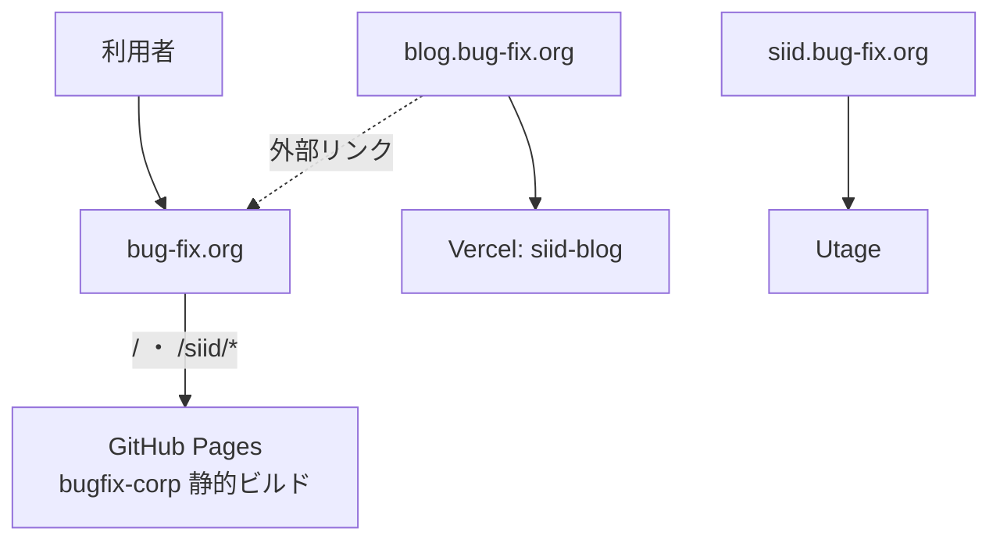
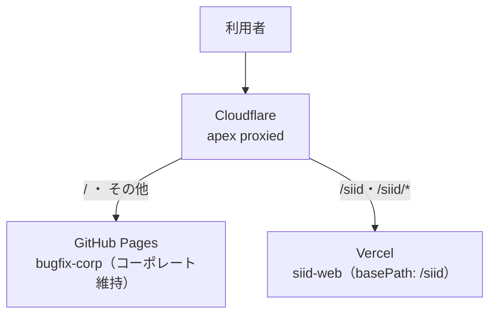

# 06. 移行・リリース計画(現行 bug-fix.org/siid → 新 SiiD サービスサイト)

新 Next.js 版 SiiD サービスサイト(本リポジトリ `siid-web`)が完成したのち、現行の `https://bug-fix.org/siid` を置き換えるためのリリース計画。**`/siid` のみをリニューアルし、運営会社コーポレートサイト(`/`)はそのまま残す**ことを制約とする(Issue #22)。

> **2026-09-10 方針変更**: 当初は既存 LP `/siid/lp-1` も GitHub Pages のまま残す計画だったが、lp-1 は Issue #40 で本アプリへ移植済みであり、さらに**廃止して今後は `/siid/lp-career` を使う**ことに決定した。これにより `/siid` 配下はすべて新アプリ(Vercel)へ向け、`/siid/lp-1` は `/siid/lp-career` へ 301 で寄せる(§3.2・§4)。

デプロイ全体方針は [05_deploy.md](./05_deploy.md) を参照。本ドキュメントは「現行サイトからの移行」に固有の計画を扱う。

---

## 1. 背景・目的

現行の `bug-fix.org` は **1 リポジトリ・1 デプロイ**で複数の面を配信しており、`/siid` だけを単純に差し替えることができない。パス単位で新旧を分離するには、ドメイン前段にルーティング層を設ける必要がある。

- 新サイト完成後、現行 SiiD サービスサイト(`/siid` 配下)のみを新 Next.js アプリへ置換する。
- コーポレートサイト(`/`)は現行のまま維持し、URL も変えない。
- 既存 LP `/siid/lp-1` は廃止し、`/siid/lp-career` へ 301 で引き継ぐ(2026-09-10 決定)。
- 現行 `/siid/*` の各 URL は SEO 継続のため 301 リダイレクトで新ルートへ引き継ぐ。

---

## 2. 現行アーキテクチャ

| 面 / URL | 実体リポジトリ | ホスティング | 本移行での扱い |
|---|---|---|---|
| `bug-fix.org/`(コーポレート) | `bugfix-corp`(Vite + EJS 静的サイト) | GitHub Pages | **維持** |
| `bug-fix.org/siid`, `/siid/*` | 同上(`src/pages/siid/*`) | GitHub Pages | **新サイトへ置換** |
| `bug-fix.org/siid/lp-1` | 同上(`src/pages/siid/lp-1/`、自己完結) | GitHub Pages | **廃止**(`/siid/lp-career` へ 301) |
| `blog.bug-fix.org` | `siid-blog`(Next.js + microCMS) | Vercel | 対象外(`/siid` へ外部リンクするのみ) |
| `siid.bug-fix.org` | Utage(`dns.utage-domain.com`) | 外部SaaS | 対象外(流用不可) |

**ポイント:**
- コーポレート(`/`)と `/siid` は `bugfix-corp` の**同一ビルドパイプライン**から生成され、共有 EJS パーシャル(`src/modules/layout/_header.html` ほか)・共有データ(`src/data/mainData.js`)・共有 SCSS に依存している。ソース上は完全分離されていない。
- `/siid/lp-1` は独自 `assets/`(専用 CSS/JS/フォント/画像)を持ち、共有ヘッダー/フッターに非依存。**単体で維持しやすい**。
- `bugfix-corp` は GitHub Actions(`.github/workflows/static.yml`)で `main` push 時に `dist/` を GitHub Pages へ publish。カスタムドメインは `CNAME` = `bug-fix.org`。



**課題:** GitHub Pages はパス単位で別バックエンドへ振り分けできない。`/`(維持)と `/siid`(置換)を分離するには、ドメイン前段のルーティング層が必須。

---

## 3. 目標アーキテクチャ(Cloudflare 前段方式)

DNS を Cloudflare 管理下に置き、`bug-fix.org` を **Cloudflare Worker** でパス分岐させる。コーポレートは GitHub Pages のまま維持し、`/siid` 配下だけを新アプリ(Vercel)へ **URL を変えずにリバースプロキシ**する。



### 3.1 DNS

**2026-09-14 実施済み(Issue #45)。** ネームサーバは `julio.ns.cloudflare.com` / `nucum.ns.cloudflare.com`。

- `bug-fix.org`(apex)および `www` を Cloudflare 管理へ移管し、**proxied(orange-cloud)** にした。
- `blog.bug-fix.org`(Vercel)・`siid.bug-fix.org`(Utage)は**現状維持**(DNS-only / プロキシ対象外)。既存挙動は変わっていない。

移管の具体的な手順・現行レコード一覧・注意点は **[§10 DNS 移管手順書](#10-dns-移管手順書issue-45)** を参照。

### 3.2 Cloudflare Worker(ルーティング)

Redirect Rule ではなく **Worker** を用いる。URL を `bug-fix.org/siid/...` のまま保ちつつ別オリジン(Vercel)の内容を返す**リバースプロキシ**が必要なため(Redirect Rule では URL が変わってしまう)。

コードは `workers/siid-router/`(テスト・デプロイ手順・有効化とロールバックの手順は同ディレクトリの README)。

分岐ロジック(lp-1 の廃止により 2 分岐。2026-09-10 改訂):

1. パスが **`/siid` と完全一致、または `/siid/` で始まる** → **Vercel の新アプリ**(`https://siid-web-theta.vercel.app` に同じパスとクエリで fetch して返す)。`/siid/lp-1` もここに含まれ、新アプリの 301(§4)で `/siid/lp-career` へ転送される
2. それ以外(`/` 等すべて)→ **GitHub Pages**(コーポレート維持。オリジンへそのまま通す)。**ただし GitHub Pages が 404 を返したページ表示(GET で `Accept: text/html`)には、新アプリの `/siid/404` を 404 のまま返す**(Issue #131、2026-09-17 追加)。画像・API・HEAD の 404 や、新アプリが 404 以外を返した・取得に失敗した場合はオリジンの 404 をそのまま返す(fail open)

- 前方一致を `/siid` だけで判定しないこと(`/siid-xxx` のような将来のコーポレート側パスまで新アプリへ流れるため)。
- Worker のルートは **`bug-fix.org/*`**(Issue #131 で `bug-fix.org/siid*` から拡張。コーポレート側の 404 を差し替えるため、`/` などのコーポレート宛リクエストも Worker を通る)。振り分けはルートではなく **Worker 内の判定**で行い、`/siid` に一致しないリクエストはオリジン(GitHub Pages)へそのまま通す(前方一致を `/siid` だけで判定すると `/siid-xxx` が Vercel へ流れて 404 になる)。
- ルートを広げた分、コーポレート全体のリクエストが Worker の実行回数に乗る。Failure mode は fail open(§7)なので、上限超過や障害時はオリジンへ素通りし、GitHub Pages 既定の 404 に戻るだけで表示は止まらない。

**プロキシ応答の HSTS**: Vercel は `Strict-Transport-Security: max-age=63072000; includeSubDomains; preload` を付ける。Worker がそのまま流すと `bug-fix.org` の全サブドメインに HTTPS 強制を 2 年間ブラウザに記憶させ、ルートを外すロールバックでも取り消せないため、**Worker で削除する**(現行サイトは HSTS を出していない。導入するならドメイン全体の方針として別途決める)。Worker は `bug-fix.org` 以外のホスト(`workers.dev` 等)ではプロキシしない。

**プロキシ応答のヘッダー処理(必須)**: 新アプリは Host が `*.vercel.app` のリクエストに `X-Robots-Tag: noindex` を付与する(直 URL の重複インデックス対策、Issue #14 / [05_deploy.md](./05_deploy.md))。Worker のオリジン fetch も Host は `*.vercel.app` になるため、**Worker は `bug-fix.org` へ返す応答から `X-Robots-Tag` ヘッダーを必ず削除する**こと。削除しないと本番サイト全体が検索エンジンから noindex 扱いになる。

### 3.3 新アプリ側(Vercel `siid-web`)

- `next.config.ts` に `basePath: '/siid'`(必要に応じ `assetPrefix`)を設定し、内部リンク・アセットパスを `/siid` 配下へ整合させる。
- Vercel 本番デプロイ。Worker はこのデプロイ URL の `/siid/*` を取得する。
- `basePath: '/siid'` は設定済み(Issue #46)。`redirects()` は未設定で、§4 のマップを Issue #48 で追加する。

---

## 4. URL リダイレクトマップ(旧 `/siid/*` → 新ルート、301)

旧サブページと新サイトのルートは 1:1 対応しないため、SEO 継続のための対応表を定める。**Issue #48 で `next.config.ts` の `redirects()` に実装済み**(basePath `/siid` 込み、ステータス 301)。

旧サイトの正規 URL は末尾スラッシュ付き(`/siid/career/`)。新アプリは末尾スラッシュを外す(308)ため、旧 URL からは「308 → 301」の 2 ホップで新ルートに着地する(クエリ文字列は保持)。

| 旧 URL | 新ルート | 状態 |
|---|---|---|
| `/siid` | `/siid`(新トップ) | パス一致。リダイレクト不要 |
| `/siid/career` | `/siid/career-path/1` | 実装済み(301)。`/career-path` は `/career-path/1` へのリダイレクトなので正規 URL へ直接送る |
| `/siid/counseling` | 同一パスで実装済み | リダイレクト不要 |
| `/siid/counseling-complete` | 同一パスで実装済み(旧 URL 互換ページ) | リダイレクト不要(`redirects()` はページより優先されるため、ここに 301 を置くと互換ページが死ぬ) |
| `/siid/counseling-complete-lp-1` | `/siid/lp-career/complete` | 実装済み(301。2026-09-12 決定)。ページは削除。このページが発火していた OpenAI Ads の CV は止まる(lp-career 側の計測は #67) |
| `/siid/white-paper` | 同一パスで実装済み(Issue #40) | リダイレクト不要 |
| `/siid/lp-1`(および `/siid/lp-1/*`) | `/siid/lp-career` | 実装済み(301)。lp-1 は削除(2026-09-10 決定)。`siid-blog` の `COUNSELING_URL` の受け皿 |
| `/siid/lp-2`(および `/siid/lp-2/*`) | `/siid/lp-career` | 実装済み(301)。Issue #76 の改名前 URL の保険(未公開だが外部設定・共有 URL に残っている可能性) |
| `/siid/tuition` | `/siid/courses` | 実装済み(301。2026-09-12 決定)。料金 → コース一覧 |
| `/siid/voices` | `/siid/career-path/1` | 実装済み(301。2026-09-12 決定)。受講生の声 → 卒業生の進路 |

---

## 5. カットオーバー手順(段階リリース)

各ステップ後に回帰確認を行い、問題なければ次へ進む。

- **Pre. DNS 移管**(Issue #45)— **2026-09-14 完了**
  - ネームサーバを Squarespace から Cloudflare へ切替。apex と `www` を proxied 化。
  - Worker 未設定のため**挙動は現行と変わらない**ことを確認済み(ダウンタイム無し、メールの実送受信テストも成功)。
  - 実施結果と手順は [§10](#10-dns-移管手順書issue-45)。
- **Step1. 新アプリ本番デプロイ(301 込み)**
  - `siid-web` を Vercel に `basePath: '/siid'` で本番デプロイ(`develop` → `main` のリリース PR)。Vercel の直 URL で単体動作確認。
  - **§4 の 301(`redirects()`)と lp-1 の削除はこの時点で入れておく**。`redirects()` は新アプリに届いたリクエストにしか効かないため、Worker 切替前に入れても本番に影響しない。切替後に入れる順序だと、lp-1 削除済みの場合 `/siid/lp-1` が切替から 301 有効化までの間 404 になる。
- **Step2. `/siid` を新アプリへ切替**
  - Worker を有効化し、`/siid` 配下を新アプリへプロキシ。
  - **回帰確認**: `/`(コーポレート)が従来どおり GitHub Pages で表示されること。§4 の全旧 URL が新ルートへ 301 で到達すること(`/siid/lp-1` → `/siid/lp-career` を含む)。§8 のチェックリストを実施。
- **公開後**
  - Google Search Console でインデックス移行・クロールエラーを監視。

---

## 6. ロールバック手順

- **`/siid` の切り戻しは Worker のルート設定を戻すだけ**で、即座に GitHub Pages(現行 SiiD サービスサイト)へ復帰できる。DNS の切替は伴わない。
- DNS 移管そのものを戻す必要が生じた場合は、ネームサーバを元に戻す(TTL 短縮済みのため反映は早い)。

---

## 7. アナリティクス引き継ぎ

現行本番ページで検出されているタグ:

- GA4: `G-54L1JQ7Q7V`
- GTM: `GTM-58D75LLL` / `GTM-NWT5NTNS` / `GTM-PCDDS7MV`

これらのうち **SiiD 固有分**と **`bug-fix.org` 全体で共有している分**の切り分けが未確定。Analytics 移行は既存 PR ではスコープ外とされ、サイト全体の別 Issue に送られている([03_pages.md](./03_pages.md) 参照)。本計画では引き継ぎ**要件の列挙に留め**、実引き継ぎは別 Issue で扱う。

---

## 8. 公開前チェックリスト(移行固有)

**2026-09-15 のカットオーバー時に全項目を実施し、全て通過した。**

[05_deploy.md](./05_deploy.md) の汎用チェックリストに加え、移行固有で以下を確認する。

- [x] `/siid/lp-1`(および配下)が `/siid/lp-career` へ 301 で到達する
- [x] コーポレート `/` に一切変化がない(200・タイトルとも従来どおり)
- [x] 旧 `/siid/*` の全 URL が §4 のマップどおり 301 で新ルートへ到達する(6 件すべて)
- [x] 新アプリが `basePath: '/siid'` でアセット 404 を出さない(`/siid`・`/siid/lp-career`・`/siid/career-path/1` をブラウザで走査。失敗リクエスト 0 件・JS エラー 0 件)
- [x] 既存外部リンクの生存: `siid-blog` の `SIID_SITE_URL`・`COUNSELING_URL`。公開後に `COUNSELING_URL` と広告の出稿先 URL を `/siid/lp-career` へ更新済み(2026-09-15)
- [x] Worker の分岐が意図どおり(`/siid-nonexistent` は Vercel ではなくオリジンへ通る。※ Issue #131(2026-09-17)以降はオリジンの 404 に新アプリの 404 ページを差し替えるため、ブラウザ表示は新アプリの 404 ページ・ステータス 404 になる。HEAD や `curl -I` では `server: GitHub.com` のまま)
- [x] `bug-fix.org/siid` の本番レスポンスに `Strict-Transport-Security` が付いていない
- [x] `bug-fix.org/siid` の本番レスポンスに `X-Robots-Tag: noindex` が付いていない / `*.vercel.app` 直アクセスには付いている
- [x] Vercel の Production 環境変数に microCMS の値が入っており、記事が表示される

補足: `b.karte.io/event` が 400 を返すが、KARTE(計測タグ)側の応答でサイトの表示・動作には影響しない。切替前からの挙動。

### 8.1 カットオーバー実施記録(2026-09-15)

| 項目 | 内容 |
|---|---|
| 実施内容 | Cloudflare Worker `siid-router` にルート `bug-fix.org/siid*` を紐付け |
| Failure mode | **Fail open (proceed)** を選択。この Worker は経路の振り分けのみでセキュリティ検査をしないため、障害時や上限超過時はオリジン(GitHub Pages)へ素通りさせる。ただし素通り時は旧サイトの内容が出る(新サイトにしかないパスは GitHub Pages の 404)。**この理由から旧サイトのコンテンツは当面 GitHub Pages に残す** |
| Cloudflare Access | Worker の preview のみ保護(Scope: Previews only)。`All traffic` にすると公開サイトに認証が要求されるため選択しない |
| ダウンタイム | 無し |
| 公開後の作業 | 広告の出稿先 URL と Jicoo の予約完了リダイレクトを `/siid/lp-career` 系へ更新済み。Google Search Console に `https://bug-fix.org/siid/sitemap.xml` を送信し「成功しました / 検出されたページ数 12」を確認 |

---

## 9. 未確定事項

- GA4 / GTM 各タグの SiiD 固有・共有の切り分けと引き継ぎ範囲
- ~~実装スコープを扱う後続 Issue の起票~~ → 起票済み: #45(DNS 移管)・#46(basePath、完了)・#47(Worker)・#48(301)

---

## 10. DNS 移管手順書(Issue #45)

カットオーバー Pre(§5)の実作業。**2026-09-14 に実施完了。** 以下は実施結果に基づく記録で、同種の作業を再度行う際の手順書でもある。リポジトリのコード変更は伴わない。

### 10.1 前提情報(2026-09-14 実施時点)

| 項目 | 値 |
|---|---|
| レジストラ | **Squarespace Domains II LLC**(https://domains.squarespace.com) |
| 移管前の DNS ホスト | **Squarespace**(DNS 設定 → カスタムレコード)。ネームサーバは `ns-cloud-b1〜b4.googledomains.com` |
| 移管後の DNS ホスト | **Cloudflare**(`julio.ns.cloudflare.com` / `nucum.ns.cloudflare.com`) |
| ドメイン有効期限 | 2027-03-13 |
| DNSSEC | 無効(親ゾーンに DS レコード無し)。そのまま切替可能だった |

> **ネームサーバ名に注意(最初にハマった点)**: `ns-cloud-*.googledomains.com` は **Google Cloud DNS と旧 Google Domains の両方**が使う。この名前から「レコードの実体は GCP の Cloud DNS にある」と判断したが誤りで、**GCP には zone が存在しなかった**。Google Domains が Squarespace に売却された結果、ネームサーバ名はそのままで**レコードの管理画面だけが Squarespace 側に移っていた**。レジストラと DNS ホストがどちらも Squarespace という状態。

### 10.2 移管前のレコード(Squarespace の DNS 設定画面の全件)

**外部から DNS を引いて見つかったのは 9 件だったが、実際には 17 件あった。** 名前を知らないと引けないレコード(所有確認・DKIM 等)は外から発見できない。**必ず DNS ホストの管理画面で全件を確認すること。**

| 名前 | 種別 | 値 | 移管 |
|---|---|---|---|
| `@` | **ALIAS** | `seito-developer.github.io` | ○(Cloudflare では A/AAAA 展開または CNAME) |
| `www` | CNAME | `seito-developer.github.io` | ○ Proxied |
| `blog` | CNAME | `cc021d3efa3de4c8.vercel-dns-017.com` | ○ **DNS only** |
| `siid` | CNAME | `dns.utage-domain.com` | ○ **DNS only** |
| `1frorysb._domainkey` | CNAME | `1frorysb.utage-dkim.com` | ○(Utage の DKIM) |
| `k76tdbf2g3ea` | CNAME | `gv-qqm4wayl2lunbr.dv.googlehosted.com` | ○(Google の所有確認) |
| `@` | MX ×5 | `1 aspmx` / `5 alt1` / `5 alt2` / `10 alt3` / `10 alt4`(すべて `.aspmx.l.google.com`) | ○ |
| `@` | TXT (SPF) | `v=spf1 include:_spf.google.com +mx include:myasp.jp ~all` | ○ |
| `_dmarc` | TXT | `v=DMARC1; p=none;` | ○ |
| `google._domainkey` | TXT (DKIM) | `v=DKIM1; k=rsa; p=…`(408 文字) | ○ |
| `_github-pages-challenge-seito-developer` | TXT | `6e4fab1312bd6f5cacbf9977c80b70` | ○(GitHub Pages の所有確認) |
| `ad` | A | `34.120.240.194` | **×** 未使用(オーナー確認済み) |
| `guide` | CNAME | `ext-sq.squarespace.com` | **×** 未使用。Squarespace のドメイン転送機能 |
| `_domainconnect` | CNAME | `_domainconnect.domains.squarespace.com` | **×** Squarespace 専用 |

移管したのは 15 件。DKIM など長い値は手入力せず `dig +short TXT google._domainkey.bug-fix.org | tr -d '" '` で取得して貼る。

### 10.3 失敗しやすい点(必読)

1. **Cloudflare の自動スキャンは取りこぼす。** 今回は `siid`・`1frorysb._domainkey`・`k76tdbf2g3ea`・`_github-pages-challenge-*` の 4 件が入らなかった。**外から引けないレコードは原理的に発見できない**ため、管理画面の一覧と 1 件ずつ照合する。
2. **スキャンは `blog` を Proxied として取り込む。** そのままだと証明書を Vercel が管理しているため証明書エラーになる。**DNS only に直す。**
3. **`siid` は絶対に Proxied にしない。** 転送先の Utage 自体が Cloudflare 配下(`104.26.x` / `172.67.x`)のため、多重プロキシとなり **Error 1000: DNS points to prohibited IP** で停止する。
4. **apex と `www` は Proxied にする。** ここが DNS only だと後段の Worker(#47)が効かない。
5. **SSL/TLS は「フル(Full)」。** 既定の「フレキシブル」だと GitHub Pages が HTTPS へリダイレクトするためリダイレクトループになる。「フル(厳密)」は proxy 配下で GitHub Pages の証明書更新が失敗しうるため避ける。
6. **DKIM の TXT は分割せず 1 レコードで登録する。** DNS 上は 255 文字ごとに分かれて見えるが、分割すると DKIM 検証が失敗する。
7. **移管元(Squarespace)のレコードは削除しない。** ネームサーバを戻すだけで復旧できる状態を保つ。
8. **apex の ALIAS は Cloudflare に無い。** スキャンは解決結果の A×4 / AAAA×4 として取り込む。そのままでも動くが、`CNAME @ → seito-developer.github.io`(CNAME flattening)にすると GitHub 側の IP 変更に自動追従する。
9. **TTL 短縮は今回は不要だった。** 新旧のレコード内容が完全に一致していれば、伝播中にどちらを参照しても結果は同じため。内容を変えながら移管する場合のみ、事前の TTL 短縮(現行 TTL は 4 時間)を検討する。

### 10.4 作業手順(実施した順序)

1. **オーナー承認**。apex を Cloudflare 配下に置くことの合意。
2. **移管元の管理画面で全レコードを確認**(今回は Squarespace の DNS 設定)。外部から引いた結果だけを信用しない(§10.2)。
3. **Cloudflare で「Add a site」→「Connect a domain」**。Free プランを選ぶ。「Transfer a domain」はレジストラ移管なので選ばない。
   - 「Block training in robots.txt」は**オフ**にした。robots.txt はオリジン(GitHub Pages / 別リポジトリ)で管理しており、edge 側で書き換わると SEO の切り分けが難しくなるため。
4. **自動スキャンの結果を §10.2 と照合**し、不足を追加・不要を削除・プロキシ状態を修正(§10.3-1〜4)。
5. **SSL/TLS を「フル」に設定**(§10.3-5)。
6. **切替前に Cloudflare のネームサーバへ直接問い合わせて照合する**(§10.5-1)。ここで抜けを潰しておけば、切替は「同じ内容の配布元が変わるだけ」になる。
7. **Squarespace → DNS → 「ドメイン ネームサーバー」**でカスタムネームサーバに変更し、Cloudflare の 2 件のみにする(`ネームサーバーの登録` は glue record 用の別機能なので間違えない)。
8. **伝播を待って §10.5-2 を実施。**
9. この時点では **Worker を設定しない**(全パスが従来どおり GitHub Pages / Vercel / Utage へ向く状態)。

### 10.5 検証

#### 10.5-1 切替前(ここが最も効く)

zone が有効化される前でも、**Cloudflare のネームサーバへ直接問い合わせれば設定内容を確認できる**。本番を切り替える前に答え合わせができる。

```bash
NEW=julio.ns.cloudflare.com; OLD=ns-cloud-b1.googledomains.com; D=bug-fix.org
for spec in "$D:MX" "$D:TXT" "www.$D:CNAME" "blog.$D:CNAME" "siid.$D:CNAME" \
            "1frorysb._domainkey.$D:CNAME" "k76tdbf2g3ea.$D:CNAME" "_dmarc.$D:TXT" \
            "google._domainkey.$D:TXT" "_github-pages-challenge-seito-developer.$D:TXT"; do
  n=${spec%:*}; t=${spec#*:}
  o=$(dig +short "@$OLD" "$t" "$n" | sort | tr '\n' ' ')
  w=$(dig +short "@$NEW" "$t" "$n" | sort | tr '\n' ' ')
  [ "$o" = "$w" ] && echo "OK   $t $n" || echo "DIFF $t $n: 旧[$o] 新[$w]"
done
```

> **プロキシ状態はこの方法では判定できない。** zone が有効化されるまで Cloudflare はプロキシを通さない生の値を返すため。オレンジ/グレーは管理画面で目視確認する。

#### 10.5-2 切替後

```bash
D=bug-fix.org
for r in 8.8.8.8 1.1.1.1 9.9.9.9; do dig +short "@$r" NS $D | sort | tr '\n' ' '; echo; done  # 委任先
dig +short MX $D; dig +short TXT $D; dig +short TXT _dmarc.$D                                  # メール系
dig +short TXT google._domainkey.$D | tr -d '" ' | wc -c                                       # DKIM は 408 文字
for u in https://$D/ https://$D/siid https://blog.$D/ https://siid.$D/; do
  echo "$(curl -sS -o /dev/null -w '%{http_code}' -L "$u") $u"
done
```

移管前後で同一になること(実測値):

| URL | 応答 |
|---|---|
| `https://bug-fix.org/` | 200 |
| `https://bug-fix.org/siid` | 200 |
| `https://bug-fix.org/siid/lp-1` | 200 |
| `https://blog.bug-fix.org/` | 200 |
| `https://siid.bug-fix.org/` | 404(移管前から 404。悪化していないことの確認用) |

- **メールの実送受信テストを必ず行う**(外部アドレスとの往復)。DNS 上レコードが見えることと実際に届くことは別。
- Google Workspace 管理コンソールでドメインの状態にエラーが出ていないか確認する。

#### 10.5-3 2026-09-14 の実施結果

| 項目 | 結果 |
|---|---|
| ネームサーバ変更の受理(whois) | 05:17 UTC |
| `.org` TLD への反映 | **6 分後** |
| 全公開リゾルバへの伝播 | 当日中に完了(委任の TTL は 3600 秒) |
| メール系 8 件 | 全件正常 |
| 実送受信テスト | 成功 |
| HTTP 応答 | 上表と完全に一致 |
| apex / `www` | Cloudflare 経由(`172.67.x` / `104.21.x`)に変化。`blog`・`siid` は直接配信のまま |
| ダウンタイム | 無し |

### 10.6 ロールバック

- **Squarespace でネームサーバを `ns-cloud-b1〜b4.googledomains.com` に戻す。** 移管元のレコードを残してあれば復旧する(§6)。
- ただしネームサーバの変更はレジストリの TTL(通常 24〜48 時間)に従うため、**即時には戻らない場合がある**。この意味でも §10.5-1 の「切替前の照合」を厚くしておくことが重要。
