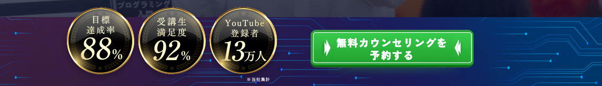
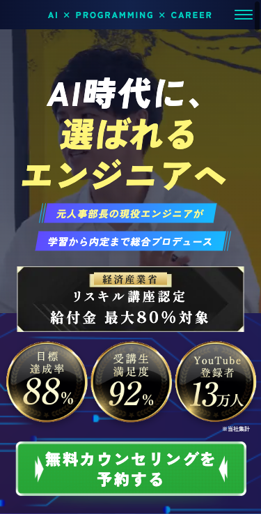

# Issue #106 表示確認

対象: `/siid/lp-career` のFV下部帯。2026-09-15、ローカル開発サーバーとChromiumで確認。

- PC/SPとも支給の装飾のみの背景とメダルスプライトを使用。
- 320 / 375 / 390 / 767 / 768 / 1024 / 1280 / 1440 / 1920pxで、横スクロールなし・メダル3個がFV内に収まる・注記とメダルの実体が重ならないことを確認。
- スプライトの背景位置は0 / 50 / 100%。各メダルの実績は読み上げ用テキストとして保持。
- FVのリンクは1個。PC/SPとも既存ボタン画像を表示し、クリックで `#counselling` の予約欄に移動することを確認。予約送信は行っていない。
- `npm run lint` / `npm run typecheck` 成功。旧ブランチで生成された削除済みページの `.next/types` キャッシュ2ファイルを整理して型チェックを再実行した。
- セルフレビューでは画像の参照先・透過・スプライトの比率・影の描画領域・CTAのCSS詳細度と他セクションへの影響を確認。

## PC（1440px、FV下部の切り抜き）

## スマホ（375px、FV全体）

